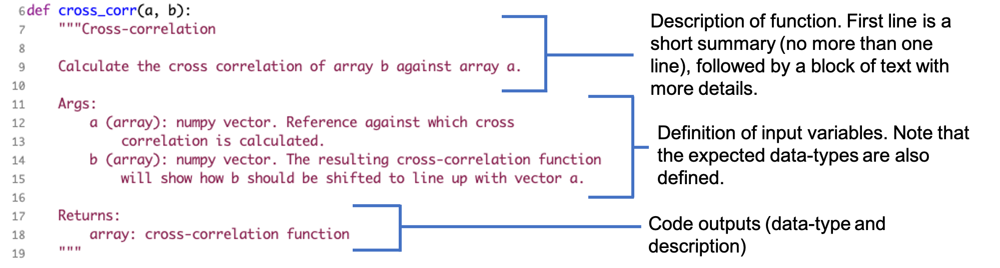
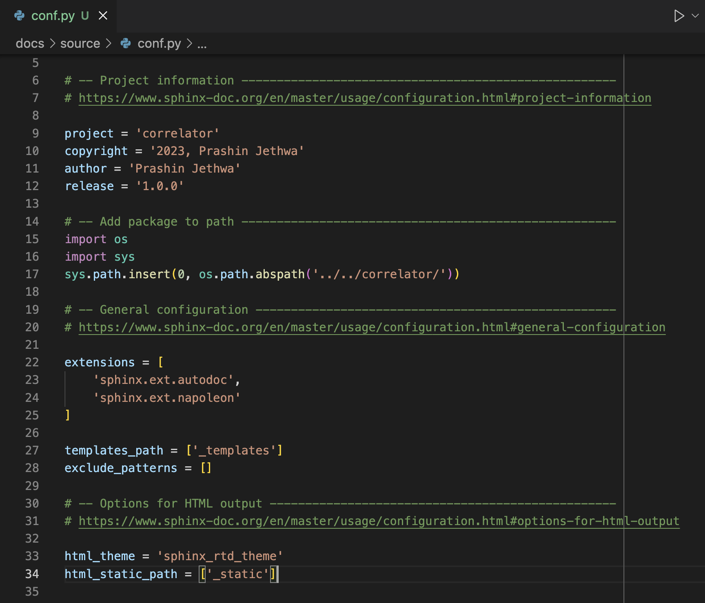
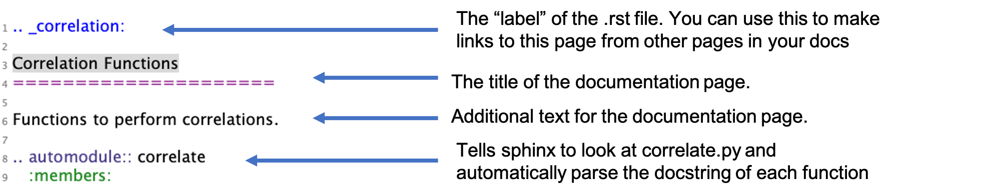
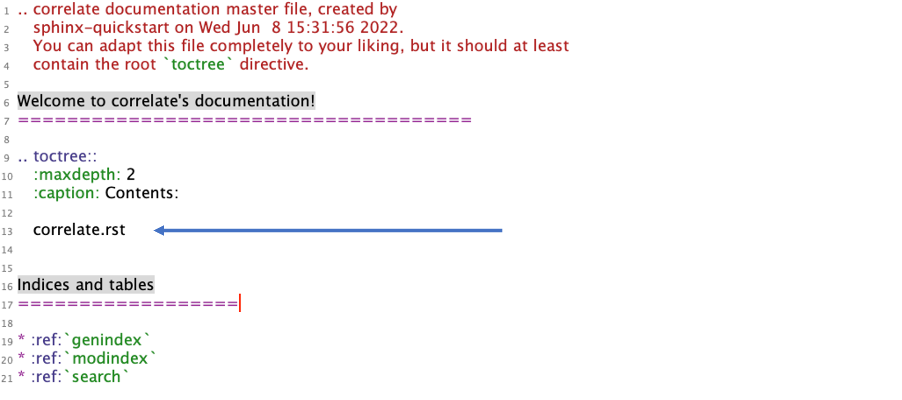

# Documentation

This guide will demo how to (1) write docstrings for Python functions, and (2)
use the `sphinx` software to build HTML webpages to display this software in
web browsers.

## `correlator` example repository

We will do this for an example repository called [correlator](https://github.com/prashjet/correlator). 
You can clone this repository to follow along with the demonstration. The 
repository structure currently looks like this:

```
├── correlator
│   ├── README.md
│   ├── correlator
│   │   ├── __init__.py
│   │   ├── correlate.py
```

There are two things to note:

1. the actual source code (i.e. the file 
`correlate.py`) is located in the directory `correlator/correlator/`, i.e. with 
the repository name repeated twice. This is a common convention, and it keeps
your source code separate from other types of files, e.g. the `README`, and
the documentation (which we will now create).

2. we need the file `__init__.py` alongside the source code. This file is empty, 
but it is needed to turn our code into a Python package which we can import elsewhere.
We will learn more about `__init__.py` when discussing packaging.

## Python Docstrings

A docstring is a string that appears in the first line of a function
or class that provides an overview of its purpose, a description of
the input variables it expects, and an explanation of the outputs
produced. There are several common styles of python
docstrings (see examples
[here](https://betterprogramming.pub/3-different-docstring-formats-for-python-d27be81e0d68)),
but today we will focus on the Google docstring. 

In the example repository, open `correlate.py` in a
text editor. These functions have Google-style docstrings. Let's look at
the different components of the docstring for the `cross_corr` function:

<p align="center">
  
</p>

This example shows a docstring for a typical function. Docstrings for
specific cases (e.g., optional input variables, classes,
exceptions, etc) have some slight modifications to this general structure.
Example docstrings for these cases (and more!) can be found [here](https://sphinxcontrib-napoleon.readthedocs.io/en/latest/example_google.html).

In addition to providing crucial information, docstrings provide a standardized way to
document code that can be easily parsed by automated
documentation tools, like
[sphinx](https://www.sphinx-doc.org/en/master/). Let's try using
sphinx to build documentation for `correlate.py`!

## Sphinx quickstart guide

1. Install the required packages. We will need sphinx

```
pip install sphinx
```

as well as additional packages `sphinxcontrib-napoleon` (to be able to use Google 
style docstrings), and the ReadTheDocs theme (i.e. the visual appearance of the
documentation page; you can see other theme examples 
[here](https://www.sphinx-doc.org/en/master/usage/theming.html))

```
pip install sphinxcontrib-napoleon sphinx-rtd-theme
```

2. We will create documentation for the functions in `correlate.py`.
Start by making a repository `correlator/docs/` i.e. so your directory looks like
```
├── correlator
│   ├── README.md
│   ├── correlator
│   │   ├── __init__.py
│   │   ├── correlate.py
│   ├── docs
```
Move into this `docs` directory, then run `sphinx-quickstart` within `docs`:
```
cd docs
sphinx-quickstart
```
Answer the questions when prompted on the terminal. Answer `y` to the question: 
`Separate source and build directories?`. This should create several files and 
directories in your `docs` directory, as shown below.
```
$ ls
Makefile	build		make.bat	source
```
The `source` directory contains the documentation source code. This is
where you will edit and add files to build your documentation. Currently it 
contains
```
$ ls
_static		_templates	conf.py		index.rst
```

The file `conf.py` is the configuration
file for the Sphinx documentation builder, which controls how Sphinx
processes your code.

3. We need to tell Sphinx where to find your python files by
defining the path. To do this, copy and paste the following lines 
somewhere into `conf.py`:
```
import os
import sys
sys.path.insert(0, os.path.abspath(LOCATION_TO_SOURCE_CODE))
```
(Note some versions of `sphinx` will add the above lines to `conf.py` 
automatically, though you may have to uncomment them.)
Now we change the argument of `os.path.abspath()` to the actual source code directory. 
To do this, use the relative path from `docs/source/`. For this example, that 
means we need to edit the final line to,
```
os.path.abspath('../../correlator/')
```
where `..` means "go one directory up". If I had used an absolute path instead
of a relative path, i.e. on my laptop if I had used
```
os.path.abspath('/Users/prash/Astro/Teaching/23_ws_OSS/correlator/correlator')
```
then other people who download my software would not be able to make the documentation.  

4. Add the extensions `sphinx.ext.autodoc` and `sphinx.ext.napoleon` to the extensions list 
in `conf.py`. The first one gives sphinx the power to read your python files and 
automatically extract docstrings. The second allows sphinx to understand google-style docstrings.

5. Change the `html_theme` variable to `sphinx_rtd_theme`. This defines the style 
of the documentation webpages. Here, we use the ReadTheDocs format. But, many others are
available (see examples [here](https://www.sphinx-doc.org/en/master/usage/theming.html))

After all the changes, your `conf.py` should look something like this:
<p align="center">
  
</p>

6. Now we are ready to build the documentation pages! Do this from the `docs` directory.
```
make html
```
This will create a basic set of documentation pages in `build/html`. Open up the `build/html/index.html` with your favorite browser.

7. This page doesn't have any of the documentation for `correlate.py` yet, so let's add that. The content of these pages are controlled by the `.rst` (reStructured text) files in `docs/source/`. Create a new `.rst` file there called `correlate.rst`. The contents of this file should look like this:
```
.. _correlation:

Correlation Functions
=====================

Function to perform correlations.

.. automodule:: correlate
   :members:
```
This will tell Sphinx automatically parse `correlate.py` and read
your docstrings in order to turn them into a nicely-formatted web
page. Here is a breakdown of what the different parts of this file mean:

<p align="center">
  
</p>

8. Link the correlate page to the index page by adding ``correlate.rst``
to ``index.rst`` under the "toctree" command. This puts
``correlate.rst`` in the table-of-contents that appears in the main
page of your documentation. Remember to match indentation levels!

<p align="center">
  
</p>

9. Run `make html` again to update the docs.

10. View your documentation by opening the file at
`build/html/index.html`. You should now see a link to the Correlation
Functions page, which has the documentation for `correlate.py`.

## Tips and Tricks

* Docstring / rst file formatting:
  * Remember to check out these
  [additional docstring examples](https://sphinxcontrib-napoleon.readthedocs.io/en/latest/example_google.html)
  to see how to handle specific cases such as optional input variables, classes, exceptions, etc.

  * .rst files offer many more text formatting options than what is
  shown in this example. Here is a nice
  [cheatsheet](https://bashtage.github.io/sphinx-material/rst-cheatsheet/rst-cheatsheet.html)
  with more options.

  * Docstrings and .rst files can be very finicky regarding syntax!
      How sphinx compiles your documentation can be sensitive to indents, skipped lines, type of punctuation used, etc.

* More details regarding some of the Sphinx commands we used:

  * `:maxdepth:`: Under the `.. toctree::` command in `index.rst`, you'll
  notice the command `:maxdepth:`. This defines the number of nested headings to
  include as links in your table-of-contents on the front page of your
  documentation. For example, `:maxdepth: = 1` means
  that only the titles of each .rst file will be included (those
  underlinded with '==='). `:maxdepth: = 2` will include these titles as well as
  the first level of subsections (those underlined with '---'). In
 the above example, we only had one title in `correlate.rst`
  ("Correlation Functions"), and so that is all that appeared. But,
  try adding a sub-section to `correlate.rst` and see what happens!

  * `:caption:`: Under the `.. toctree::` command in `index.rst`, you'll
  also notice the command `:caption: Contents:`. The `:caption:`
  command is a way you can set the title for that particular section
  in that compiled documentation. In the example above,
  we assign the title `Contents:` `.. toctree::` section. This
  command is optional and does not need to be used.

  * `.. automodule::`: In `correlate.rst`, we use the command
  `.. automodule::` followed by `:members:`to tell sphinx to document
  all functions, classes, etc (i.e. the "members") of our python
  module that have defined docstrings. However,
  you can tweak this command in many ways: for example, you can
  document a specific class, rather than an entire module
  (`.. autoclass::`), you can document
  only specific members within a given module (`:members: func1,
  func2`), include entries for
  functions that don't have docstrings (`:undoc-members:`), and more. Check out the
  [autodoc documentation](https://www.sphinx-doc.org/en/master/usage/extensions/autodoc.html)
  for ways to can control these commands.

  * `Indices and tables` section: In `index.rst`, sphinx automatically
    created an `Indices and tables` sections with references to
    `genindex`, `modindex`, and `search`. This created the Index,
    Module Index, and Search page in for our documentation,
    respectively. These are optional, and so you can remove them if
    you'd like.

* In the example above, let's say we wanted to insert a link to the correlation 
  function page somwhere (say, under the "Indicies and tables" sections of the index page).
  Now that the `correlate.rst` file has been added under the toctree, we can refer to its label using `:ref:` command:
```
Indices and tables
==================
We can make a link to the correlation page by referring to its label
  like this :ref:`correlation`.
  
* :ref:`genindex`
* :ref:`modindex`
* :ref:`search`
 ```

## Activity: Building Sphinx Documentation For Your Repository
1. Document at least one function in your package with a docstring. 
2. Set up sphinx documentation for your project repo and build the doc
page for your function(s). Make sure it builds correctly!
    * Hint: to begin, make a `docs` directory in your repo, just like
      step 4 in the example above. 


## Activity Wrap-Up: Moving Forward with Code Documentation
We've focused on the basics of how to document your code using
docstrings and how to automatically compile those docstrings into
webpages via Sphinx. This is crucial to help other users
(and yourself!) use your code in the future. As you work
on your python packages, keep in mind that it is
useful to include other information in your documentation as
well, such as:

* Installation instructions 
* Quick-start guides, tutorials, and code examples
* How users might cite/give credit to your code, as
well as a list of folks who have contributed to your code
* A change-log: how your code has evolved with different versions/releases
* How users might contribute to your code and/or report issues

If there is a software package that you often use in your own work,
take a look at its documentation. What info is included, and what do
you find most useful? Is the documentation easy to understand and
navigate? By looking at other documentation, you can get a
sense of what works and doesn't work for you as you document your own
package. For additional examples of code documentation, check out the
pages for [orbitize](https://orbitize.readthedocs.io/en/latest/index.html),
[RadVel](https://radvel.readthedocs.io/en/latest/), and
[SPISEA](https://spisea.readthedocs.io/en/latest/). 

## Bonus Afternoon Activity: Linking your Sphinx Documentation with ReadTheDocs
In most cases, we want to host our sphinx documentation online so that
other users can access it easily. If your code is in a GitHub repo, is
public, 
and has sphinx documentation set up as above,
then you can host your documentation via
[ReadTheDocs](https://readthedocs.org/). One very nice aspect of
ReadTheDocs is that you can have it automatically recompile
the documentation each time a change is pushed to your code
repository. Just like that, you have documentation that updates
itself!

ReadtheDocs provides a nice
[tutorial](https://docs.readthedocs.io/en/stable/tutorial/) on how to
set it up. You will need to:

1. Make a free ReadTheDocs account and authorize it to access your
GitHub account ("Sign Up for Read the Docs")

2. Import your repository as a new ReadTheDocs project ("Import the
   Project for Read the Docs")

3. Build your documentation; make sure it runs to completion and that
the output webpage looks the way you expect it to ("Checking the First Build")

4. Set it up so that the docs are automatically recompiled if a push
is made to the github repo. In the ReadtheDocs project page,
click on the `Advanced Settings` link on the left under the `Admin`
menu, check the “Build pull requests for this project” checkbox,
and click the Save button at the bottom of the page. (From "Trigger a
Build from a pull request"). 


