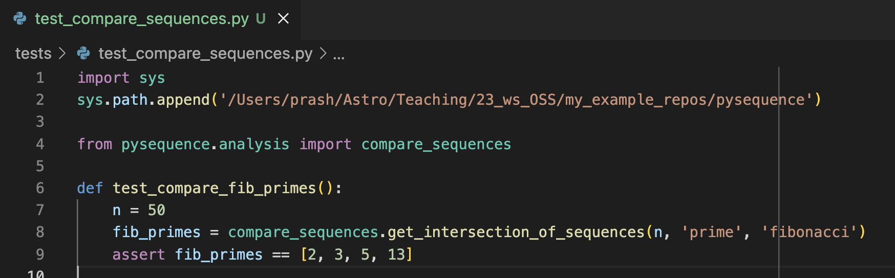
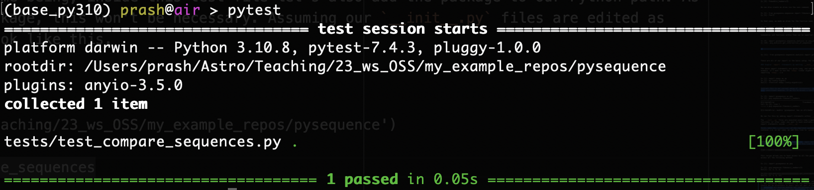

# Package Structure and Writing Tests

Today I will demonstrate how to (1) structure your package (based on info from the [official Python documentation](https://docs.python.org/3/tutorial/modules.html#packages)), and (2) write and run tests using [`pytest`](https://docs.pytest.org/en/7.4.x/) framework. For both sections, we'll use an example repository called [pysequence](https://github.com/prashjet/pysequence). You can clone this repository to follow along with the demonstration.

Key take aways:
- know what Python modules and packages are,
- what to include in an `__init__.py`,
- know what your tests should check,
- know the difference between unit tests and end-to-end tests,
- how to write and exeucute tests using `pytest`,

## Package Structure

The repository structure should initally looks like this:

```
├── pysequence                          # the repository
│   ├── README.md
│   ├── pysequence                      # top-level package
│   │   ├── __init__.py                 # to initialize the package
│   │   ├── sequences.py                # a module within the package
│   │   ├── analysis                    # a subpackage
│   │   │   ├── __init__.py             # to initialize the subpackage
│   │   │   ├── compare_sequences.py    # a submodule i.e. a module within the subpackage 
```

The main repository `pysequence` is at the top of the directory tree. This source code for the Python package itself lives in the directory `pysequence/pysequence/` i.e. with the package name repeated twice. The repitition of the package name is a common convention, but you can choose a different name for the repository and the package directories if you prefer. Aside from the package source code, the repository also contains many other files, e.g. the `README`, and soon we will also create a `test` directory here.

The file `sequences.py` contains functions defining mathematical sequences, e.g.

<p align="center">
  
</p>

When using our package, we want to be able to import functions such as `fibonacci_numbers` for use elsewhere. The package also contains an `analysis` subpackage, with 

Now we're ready for some definitions:
- **module**: a *file* containing Python statements and functions to be imported in other places (e.g. the `sequences.py` file is a module)
- **package**: a *directory* containing a collection of modules (e.g. `pysequence`). They are structured so that modules inside a package can be imported using *dotted module names* e.g. `pysequence.sequences` is the dotted module name for the `sequences.py` file
- **subpackages/submodules** are directories/files nested within the top-level package. It is possible to define a hierarchy of subpackages within subpackages etc...

The `__init__.py` file tells Python that the host directory is a package. Each sub-package needs its own `__init__.py` file. For the simplest case, we leave `__init__.py` as an empty file.

### Where can I import from?

By default, you can only import a package when you are in the directory containing that package, e.g. only when you're in the main `pysequence` repository can you import the package via `import pysequence`.

This isn't what we want! One of the main reasons for creating a software package is to keep the package separate from scripts and notebooks which use the package. Without this, it quickly becomes difficult to re-use your software in different contexts. We want to be able to import out package from any location.

There are two ways to solve this. This first solution is to *install* your software package. We will eventually do this, but for the time being, we will use the temporary solution of adding the directory containing the package to your Python path. I will do this interactively inside an `ipython` session as follows,

```
import sys
sys.path.append('/Users/prash/Astro/Teaching/23_ws_OSS/my_example_repos/pysequence/')
```

A more permanent solution is to edit the `PYTHONPATH` variable in your `bashrc` file (see [here](https://bic-berkeley.github.io/psych-214-fall-2016/using_pythonpath.html) for instructions).

### different ways to `import`

Now that Python knows where to find our package, we can import modules and their functions. To access the `fibonacci_numbers` function, we have two basic options. Either importing the module, then appending the function name when we want to use it,

```
In [1]: import pysequence.sequences
In [2]: pysequence.sequences.fibonacci_numbers(5)
Out[2]: [1, 1, 2, 3]
```

or importing the function *from* the module,

```
In [3]: from pysequence.sequences import fibonacci_numbers
In [4]: fibonacci_numbers(5)
```

We can also create an alias via the *as* command, 

```
In [5]: from pysequence.sequences import fibonacci_numbers as fib
In [6]: fib(5)
```

In that case, we made an alias for the function name, but we could also have created an alias for the module,

```
In [7]: import pysequence.sequences as psq
In [8]: psq.fibonacci_numbers(5)
```

Submodules and functions within them can be imported similarly, e.g.

```
In [9]: import pysequence.sequences.analysis as psq_analysis
In [10]: psq_analysis.get_intersection_of_sequences
```

or 

```
In [11]: from pysequence.sequences.analysis import get_intersection_of_sequences
```

These are all of our import in the basic setup. For more advanced options, we need to edit our `__init__.py`.

### Simpler `import` statements by editing `__init__.py`

The above import statements are quite long and cumbersome. They are somewhat different to how imports work for many common Python packages. For example, if I want to use the `numpy` linear algebra function to calculate eigenvalues, I can access it just by importing `numpy`, i.e.

```
In [1]: import numpy as np
In [2]: np.linalg.eigvals
Out[2]: <function numpy.linalg.eigvals(a)>
```

Another way to say this is that after importing `numpy`, the function `np.linalg.eigvals` is available in my *namespace*.

Contrast this to our current setup of `pysequence`. If we just import `pysequence` we do not have access to any of it's constituent modules. If we try to access a function as we did with numpy, we get an `AttributeError`,

```
In [3]: import pysequence as psq
In [4]: psq.sequences.fibonacci_numbers
---------------------------------------------------------------------------
AttributeError                            Traceback (most recent call last)
Cell In [4], line 1
----> 1 psq.sequences.fibonacci_numbers

AttributeError: module 'pysequence' has no attribute 'sequences'
```

We can make `pysequence` more closely resemble `numpy` by editing its `__init__.py` files.

The `__init__.py` files are executed every time a package/sub-package is imported. In principle, they can contain any functions or other code you want to have available when you import the package. In practice, this can be confusing, so I recommend only adding import statements inside `__init__.py`.

#### Recommeded `__init__.py` strategy

First, edit the `__init__.py` of the top-level package so that it imports all the top-level modules and subpackages i.e. in our case, we add this line `pysequnce/__init__.py`,

```
from . import sequences, analysis
```

Next, iterate down through the subpackages, again editing their `__init__.py` file to import all of the constituent modules and subpackages i.e. we add this line to `pysequnce/analysis/__init__.py`,

```
from . import compare_sequences
```

This recipe allows you to have access to all the package contents just by importing the top-level package, e.g. we can now access all the following methods

```
In [1]: import pysequence as psq

In [2]: psq.sequences.fibonacci_numbers(5)
Out[2]: [1, 1, 2, 3]

In [3]: psq.analysis.compare_sequences.get_intersection_of_sequences(50, 'prime', 'fibonacci')
Out[3]: [2, 3, 5, 13]
```

#### Other `__init__.py` strategies

Sometimes, you might want to edit your `__init__.py` files in a different way. Two possible reasons are:

1. if you don't want all modules/subpackages to be available to the end user (i.e. you want to exclude them from the API), then just don't import them in the `__init__.py` files. This might be useful if some modules/subpackages are needed for internal calculations, but you don's intend/want users to to access them.

2. if you want all functions available just one dot away from the main package name, you can import all the desired modules and sub-packages directly in the top-level `__init__.py`. e.g if our top level `__init__.py` contained

```
from .analysis.compare_sequences import get_intersection_of_sequences
```

then we have that function available one dot away, i.e. 

```
In [1]: import pysequence as psq
In [2]: psq.get_intersection_of_sequences
```

One downside to this last option is that all the subpackage structure becomes lost when you import the main package, i.e. we can no longer tell from the import statements that `get_intersection_of_sequences` function lives in the `analysis.`. If this is the behaviour you want, however, perhaps question why you needed to organise your package into subpackages in the first place...?

### `if __name__ == "__main__":`

If you run the file `sequences.py` from the command line, i.e

```
python sequences.py
```

then the code snippet at the bottom is executed and the output is printed. This snippet lives inside the `if __name__ == "__main__"` check. This check only evaluates to `True` when you run the file directly (e.g. via `python sequences.py`) and *not* when the file is  imported by another module. This is why we need the `if __name__ == "__main__"` check. Without it, the code snippet would run (and the output would be printed) every time we imported the `sequences` module.

### Intra-package Relative Imports

In the submodule `compare_sequences.py` we can see an example of an intra-package relative import:

```
from ..sequences import get_sequence
```

In this line, the double dots `..` mean to look in one directory up relative to the current subpackage. Three dots mean to look two directories up (etc), while a single dot is used to import a different module or subpackage within the *same* level of the package, e.g. if we wanted to import the `compare_sequences` module inside `sequences.py`, we could do the following,

```
from .analysis import compare_sequences
```

**Note**: Beware of circular imports i.e. if two modules are both trying to import from one another. This creates an infinite loop, and will raise an error. AFAIK, this is a fundamental limitation. If you find yourself needing a circular import, you might need to restructure your code.

### Relative imports in main scripts

If we try running the file to execute the example code snippet, as we did with `sequences.py`, we see the following error,

```
ImportError: attempted relative import with no known parent package
```

i.e. you cannot run module directly (i.e. as a main file) when it contains a relative import.

There are a couple of [workarounds](https://stackoverflow.com/questions/16981921/relative-imports-in-python-3) for this. Perhaps the most straightforward is to replace the relative import statement with an absolute import. But even in that case, in order to be able to run the `compare_sequences.py` file directly, you still have to make sure your `PYTHONPATH` varible is correctly set. To safely guarantee this from within the `compare_sequences.py` file itself, you would need something like,

```
import sys
sys.path.append(' ')
from pysequence.sequences import get_sequence
```

Setting the path like this from within the module itself can make the package very difficult to maintain. I advise not to do it. Avoid using code snippets such as these in the modules themselve.Instead they can live in example scripts, or even in your test suite. Which brings us nicely on to testing...

## Testing

We all test our code to some extent, but excellent developers spend *most of their time writing tests*. Writing excellent tests requires **creativity**; excellent developers try to anticipate and test as many use cases of their software as possible. Testing also ensures that your code maintains the same behavior over time. Get in the habit of writing extensive, thorough tests.

There are two main types of test:

#### Unit tests

- a unit is the smallest testable part of any software.
- unit tests evaluate the correctness of individual elements of your code,
- what they *should* test:
    - test that the output of a function is correct for every type of input
    - test edge cases, e.g. if your code operates on integers, test the input 0, if it operates on lists, try the empty list
    - test that expected error messages are raised when appropriate
- what they *don't need to* test:
    - inputs that are not allowed by your documentation

#### End-to-end tests

- evaluate a code’s ability to perform its intended function,
- test overall performance and accuracy of code’s main functions,
- test the way that users will interact with the code works,
- these might take longer to run than unit tests, in which case you might not want to run them as often

### Python `assert`

Tests will make use of the Python assert statemement. This is `assert` followed by a statement. If the statement is true, then the `assert` passes, e.g.

```
In [1]: assert 1==1 # this passes
```

while a false statement raises an `AssertionError`, i.e.

```
In [2]: assert 1==2
---------------------------------------------------------------------------
AssertionError                            Traceback (most recent call last)
Cell In [2], line 1
----> 1 assert 1==2
```

**Note**: these examples use the `==` operator to compare two objects and check they are the same. This isn't always the right operator to use e.g. when checking if two floating point numbers are the same up to machine precision, then the `numpy` function `np.isclose` is a better choice. Similarly `np.allclose` is best for comparing two arrays of floats.

### Using `pytest`

**Note**: the import statements I use in this section assume that you have set up your `__init__.py` in the recommended way.

1. Install the `pytest` package

```
pip install pytest
```

2. Create a `test` directory in the main repository (i.e. on the same level as the `README`).

3. Create test files in the test directory with names of the form `test_*.py`, which should contain test functions whose names start with `test_` (`pytest` will automatically look for these functions).

For our first test, let's borrow the code-snippet from `compare_sequences.py` and move this to a new file `test/test_compare_sequences.py`. For the time being, inside this test file let's also add the package to our Python path (once we have installed the package, this won't be necessary). Assuming our `__init__.py` files are edited as described above, the test file will look like this,

<p align="center">
  
</p>

The final line of every test function should be an assert statement. This is how `pytest` determines if the test passed or failed.

4. Run the test. From the main repository, run `pytest`

```
pytest
```

You should see the following output,

<p align="center">
  
</p>

You can add more test functions in this test file, and create more test files in your test directory: `pytest` automatically finds and runs them all.

**Note**: as always, this is just the very basic usage. See the [pytest documentation](https://docs.pytest.org/en/7.4.x/) for lots more options.

### What have I actually gained by doing this...?

What have we achieved by writing the previous test? We wrote some code, evaluated its output, then wrote a test to check that it returned the same output. Isn't this test always going to trivially pass!?

There are three points related to this:

1. ideally not every test should be a comparison against existing output from the code e.g. we might just every number returned by `even_numbers` is even.

2. if we do check against output from our own code, we should try to be extra sure that this output is correct. Ideally we would check against an external source. For our example, [Wikipedia](https://en.wikipedia.org/wiki/Fibonacci_prime) can confirm for us that the only Fibonnaci prime numbers below 50 are [2, 3, 5, 13].

3. we might reimplement certain parts of our code - e.g. let's replace the `intersection` function now. In this context, checking against prior code output does at least guarantee that reimplementation has not changed behaivour unexpectedly.

### Testing best practice

- Test as many use cases of your code as possible.
- Write both unit tests and end-to-end tests.
- Write tests throughout the development process. Some developers even advocate for writing tests before you write code!
- Coverage is the fraction of your source code that is touched by a test. It is important... up to a point. It’s more important to test your code in all the ways your users will apply it than to get 100% test coverage. 100% coverage does not mean bug-free.
- A great way to get up to speed with a code you haven’t worked with before is to write tests.

In an upcoming lecture, we will discuss continuous integration (CI). This allows tests to automatically run at specified points in code development (e.g. each time you commit, or make a pull request, or make a versioned code release). Lots of popular CI tools are based on `pytest`.

# Activity

1. think of some ideas to test `pysequence`. Think of unit tests for each individual function, and think of edge cases. (5 minutes).

2. Write and run a unit tests for `pysequence`:
- clone the repository and set up your `__init__.py` in the recommended way,
- make a test directory, with a test file, and a test function. Don't forget to add the package to your path (in the test file, or via your `bashrc` file),
- install `pytest` and use it to execute the test