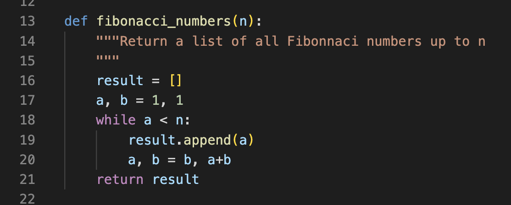

# Package Structure and Writing Tests

Today I will demonstrate how to (1) structure your package (based on info from the [official Python documentation](https://docs.python.org/3/tutorial/modules.html#packages)), and (2) write and run tests using [`pytest`](https://docs.pytest.org/en/7.4.x/) framework. For both sections, we'll use an example repository called [pysequence](https://github.com/prashjet/pysequence). You can clone this repository to follow along with the demonstration. 

## Package Structure

The repository structure should initally looks like this:

```
├── pysequence                          # the repository
│   ├── README.md
│   ├── pysequence                      # top-level package
│   │   ├── __init__.py                 # to initialize the package
│   │   ├── sequences.py                # a module within the package
│   │   ├── analysis                    # a subpackage
│   │   │   ├── __init__.py             # to initialize the subpackage
│   │   │   ├── compare_sequences.py    # a submodule i.e. a module within the subpackage 
```

At the top of the tree is the repository, called `pysequence`. This will contain the source code for the Python package itself, which lives in the directory `pysequence/pysequence/` i.e. with the package name repeated twice. The repitition of the package name is a common convention, but you can choose a different name for the repository and the package directories if you prefer. Aside from the package source code, the repository also contains many other files e.g. the `README`. Soon we will also create a `test` directory here.

The file `sequences.py` contains functions defining mathematical sequences, e.g.

<p align="center">
  
</p>

When using our package, we want to be able to import functions such as `fibonacci_numbers` for use elsewhere.

Now we're ready for some definitions:
- **module**: a file containing Python statements and functions to be imported in other places (e.g. the `sequences.py` file is a module)
- **package**: a way of structuring collections of modules so that they can be imported using *dotted module names* e.g. `pysequence.sequences` is the dotted module names for the `sequences.py` file
- **subpackages/submodules** are nested directories/files within the top-level package. It is possible to define a hierarchy of subpackages within subpackages etc...

The `__init__.py` file is needed to tell Python that the host directory is a package. Each sub-package needs its own `__init__.py` file. For the simplest case, we leave `__init__.py` as an empty file.

### Where can I import from?

By default, you can only import a package when you are in the directory containing that package, e.g. only when you're in the main directory for the `pysequence` repository can you `import pysequence`.

This isn't what we want! One of the main reasons for creating a software package is to keep the package separate from scripts and notebooks which use the package. Without this, it quickly becomes difficult to re-use your software in different contexts. We want to be able to import out package from any location.

There are two ways to solve this. This first solution is to *install* your software package. We will eventually do this, but for the time being, we will use the temporary solution of adding the directory containing the package to your Python path. I will do this interactively inside an `ipython` session as follows,

```
import sys
sys.path.append('/Users/prash/Astro/Teaching/23_ws_OSS/my_example_repos/pysequence/')
```

A more permanent solution is to edit the `PYTHONPATH` variable in your `bashrc` file (see [here](https://bic-berkeley.github.io/psych-214-fall-2016/using_pythonpath.html) for instructions).

### different ways to `import`

Now that Python knows where to find our package, we can import modules and their functions. To access the `fibonacci_numbers` function, we have two basic options. Either importing the module, then appending the function name when we want to use it,

```
In [1]: import pysequence.sequences
In [2]: pysequence.sequences.fibonacci_numbers(5)
Out[2]: [1, 1, 2, 3]
```

or importing the function *from* the module,

```
In [3]: from pysequence.sequences import fibonacci_numbers
In [4]: fibonacci_numbers(5)
```

We can also create an alias via the *as* command, 

```
In [5]: from pysequence.sequences import fibonacci_numbers as fib
In [6]: fib(5)
```

In that case, we made an alias for the function name, but we could also have created an alias for the module,

```
In [7]: import pysequence.sequences as psq
In [8]: psq.fibonacci_numbers(5)
```

Submodules and functions within them can be imported similarly, e.g.

```
In [9]: import pysequence.sequences.analysis as psq_analysis
In [10]: psq_analysis.get_intersection_of_sequences
```

or 

```
In [11]: from pysequence.sequences.analysis import get_intersection_of_sequences
```

These are all of our import in the basic setup. For more advanced options, we need to edit our `__init__.py`.

### Simpler `import` statements by using `__init__.py`

The above import statements are quite long, and not what we are accustomed to in lots of common Python packages. For example, if I want to use the `numpy` linear algebra function to calculate eigenvalues, I have access to it just by importing `numpy`, i.e.

```
In [1]: import numpy as np
In [2]: np.linalg.eigvals
Out[2]: <function numpy.linalg.eigvals(a)>
```

Contrast this to our current setup of `pysequence`, where by simply importing `pysequence` we do not have access to any of it's constituent modules. If we try to access a function as we did with numpy, we get an `AttributeError`,

```
In [3]: import pysequence as psq
In [4]: psq.sequences.fibonacci_numbers
---------------------------------------------------------------------------
AttributeError                            Traceback (most recent call last)
Cell In [4], line 1
----> 1 psq.sequences.fibonacci_numbers

AttributeError: module 'pysequence' has no attribute 'sequences'
```

We can fix this by adding import statements within `__init__.py` files.

The `__init__.py` files are executed every time a package/sub-package is imported. In principle, they can contain any functions (or other code) you want to have available when you import the package. In practice, I recommend only adding import statements inside `__init__.py`.

First, edit the `__init__.py` of the top-level package, to import all of the modules and (top-level) subpackages that it contains i.e. in our case, we add this line to `pysequnce/__init__.py`,

```
from . import sequences, analysis
```

Next, iterate down through the subpackages, again editing their `__init__.py` file to import all of the constituent modules and subpackages they contain i.e. we add this line to `pysequnce/analysis/__init__.py`,

```
from . import compare_sequences
```

This recipe allows you to have access to all the package contents just by importing the top-level package, e.g. we can now access all the following methods

```
In [1]: import pysequence as psq

In [2]: psq.sequences.fibonacci_numbers(5)
Out[2]: [1, 1, 2, 3]

In [3]: psq.analysis.compare_sequences.get_intersection_of_sequences(50, 'prime', 'fibonacci')
Out[3]: [2, 3, 5, 13]
```

This provides a familiar way to interact with python packages.

### `if __name__ == "__main__":`

If you run the file `sequences.py` from the command line, i.e

```
python sequences.py
```

then the code snippet at the bottom is executed and the output is printed. This snippet is inside the `if __name__ == "__main__"` check. This statement only evaluates to `True` when you run the file directly, not when the file is imported by another module. This is why we need the `if __name__ == "__main__"` check. Without it, the code snippet would run (and the output would be printed) every time we imported the `sequences` module.

### Intra-package References

In the submodule `compare_sequences.py` we can see an example of an intra-package reference, i.e. an import statement within the package. This line

```
from ..sequences import get_sequence
```

is a *relative* import, where the double dots `..` mean to look in one directory *up* from the current subpackage. A single dot could be used to import a different module within the *same* level of the package.

If we try running the file to execute the example code snippet, as we did with `sequences.py`, we see the following error,

```
ImportError: attempted relative import with no known parent package
```

i.e. you cannot run module directly when it contains a relative import.

There are a couple of (workarounds)[https://stackoverflow.com/questions/16981921/relative-imports-in-python-3] for this. Perhaps the most straightforward is to replace the relative import statement with an absolute import. But even in that case, in order to be able to run the `compare_sequences.py` file directly, you still have to make sure your `PYTHONPATH` varible is correctly set. To safely guarantee this from within the `compare_sequences.py` file itself, you would need to replace the relative import with something like the following

```
import sys
import os
SCRIPT_DIR = os.path.dirname(os.path.abspath(__file__))
sys.path.append(os.path.dirname(SCRIPT_DIR))
from pysequence.sequences import get_sequence
```

But this is a bit of a pain! My recommendation would be to use code snippets such as these in the tests, rather than in the modules themselves. Which brings us nicely on to testing...

## Testing

Why test?

- edge-cases

### Types of test

- unit-tests
- end-to-end tests

### Python `assert`

### Using `pytest`

Let's write our first test. The code example inside 

In the file `compare_sequences.py` we see an intra-package references, i.e. the line

### What have I actually gained by doing this...?

It feels 

https://stackoverflow.com/questions/3697432/how-to-find-list-intersection

### Next time

Continuous integration (CI): automatically run these tests at specified stages of code development (e.g. each time you commit, or make a pull request, or make a versioned code release). Lots of popular CI tools are based on `pytest`. In the next lecture, I'll show you how to set this up!

### Testing best practice

