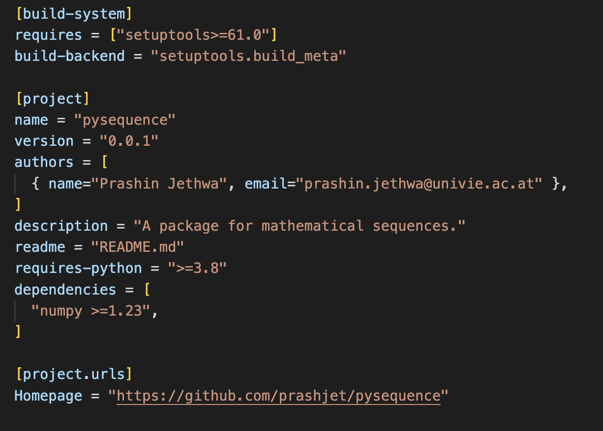
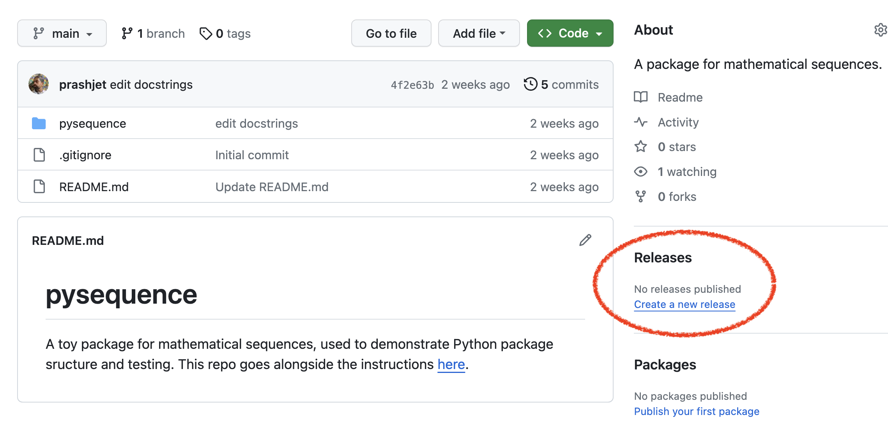

# Packaging and Distributing Projects

Key take-aways from today:

1. know two meanings of the term "package" in Python
2. how to make your package installable i.e. make it into a distribution package:
  - so you can locally install via `python -m pip install .`
  - to publish to the Python Package Index (PyPI) so others can install via `pip install my_package`
3. know what version numbers mean, and know when to update them
4. know how to make a release on Github

The official Python [packaging documentation](https://packaging.python.org/en/latest/overview/) is very good. Specifically for this demonstration, we'll more-or-less follow the [packaging projects tutorial](https://packaging.python.org/en/latest/tutorials/packaging-projects/) - look there for more details.

We'll use an example repository called [pysequence](https://github.com/prashjet/pysequence). You can clone this repository to follow along with the demonstration.

## Confusing terminology: package

The term "package" is used in two ways in Python:

- [import packages](https://packaging.python.org/en/latest/glossary/#term-Import-Package): 
  - a directory containing modules and `__init__.py` files that you can import
  - this is what we discussed [last time](https://github.com/prashjet/oss4astro/tree/main/package_and_test).
- [distribution packages](https://packaging.python.org/en/latest/glossary/#term-Distribution-Package): 
  - a versioned archive file that contains Python packages, modules, and other resource files that are used to distribute a release.
  - e.g. if you publish your project to PyPI, then you will upload the distribution package file

Be aware that if you come across the term "packaging" on its own, it could refer to either one of these very different meanings.

## Making a distribution package

First install and/or update the required tools for building/installing:
- `python3 -m pip install --upgrade pip`          # to install packages 
- `python3 -m pip install --upgrade setuptools`   # a backend for building packages (i.e it's used behind the scenes, you don't call it directly)
- `python3 -m pip install --upgrade build`        # a frontend for building packages
- `python3 -m pip install --upgrade twine`        # to upload your package to PyPI

Create two new files to the top level of the repository: `pyproject.toml` and `LICENSE`:

```
├── pysequence
│   ├── pyproject.toml
│   ├── LICENSE
│   ├── README.md
│   ├── pysequence                      
│   │   ├── __init__.py                 
│   │   ├── ...
```

The `LICENSE` file copyrights your open-source code and gives you legal rights over your work. [Here](https://choosealicense.com/) is some advice on choosing a license. My default choice is the [MIT License](https://opensource.org/license/mit/).

The `pyproject.toml` file contains project information, and settings required by other tools (e.g. `pip`). Our completed `pyproject.toml` file looks like this:

<p align="center">
  
</p>

This has three sections:
- `[build-system]`
  - tells build frontend tools (like `pip` and `build`) which backend to use for your project. We will use the `setuptools` backend.
  - other backend options are Hatch, Flit, PDM. Find brief descriptions of what they offer [here](https://packaging.python.org/en/latest/key_projects/#hatch).
- `[project]`, 
  - `name`: this must match the name of the top-level import package (i.e. the one containing the modules and top `__init__.py`)
    - if you follow along this tutorial, change the name of top-level import package to `pysequence_YOUR_NAME_HERE`
    - do this both the directory name, and in `name` entry of `pyproject.toml`
    - this is so that we don't all try to upload the same package to PyPI simultaneously,
  - `version`: for now, we put the version number in here by hand. Later we will automate this.
  - `description`: a one-sentence summary,
  - `readme`: the file name of the readme file
  - `dependencies`: a list of dependencies, with version numbers specified with `==`, `>=`
- `[project.urls]`: a hamepage (e.g. the GitHub repository URL), and possibly you can add others here e.g. for the documentation, GitHib Issue tracker etc.

[Here](https://packaging.python.org/en/latest/guides/writing-pyproject-toml/#writing-pyproject-toml) is a full list of what can go in your `pyproject.toml` file. One relevant further section is [optional dependencies](https://packaging.python.org/en/latest/guides/writing-pyproject-toml/#dependencies-optional-dependencies): e.g. you could have a set of optional dependencies related to building the package (e.g. `pytest` for tests, `sphinx` for docs). You can create a list of these under a label `build`, then a user can install these via `pip install your-project-name[build]`.

### Installing locally 

You are now ready to install this package locally. From the main repository, run:

```
python3 -m pip install .
```

Your package is now installed, and you can import it and use it in the normal way. Behind the scenes, `pip` and `setuptools` create a distribution package, and move it to the location where your packages are kept. You can check this location using:

``` 
import pysequence
pysequence.__path__
```

Another option is to install the package in editable mode:

```
python -m pip install --editable .
```

In this mode, edits you make to modules will take effect without the need to re-install the package.

### Uploading to `PyPI` for others to install

First, to build the distribution package,

`python3 -m build`

This command should output a lot of text and once completed should generate two files in the dist directory:

```
dist/
├── pysequence-0.0.1-py3-none-any.whl
└── pysequence-0.0.1.tar.gz
```

Next we'll upload it to [TestPyPI](https://test.pypi.org/). This is a version of PyPI intended for testing and experimentation. It’s great for things like this tutorial where we don’t necessarily want to upload to the real index. For your real package, upload it to [PyPI](https://pypi.org) rather than TestPyPI.

Steps to upload package to TestPyPI:
- [register](https://test.pypi.org/account/register/) an account
  - validate your email address
  - setup two factor authentification
- make an [API token](https://test.pypi.org/manage/account/#api-tokens)
- upload to the TestPyPI:
  - `python3 -m twine upload --repository testpypi dist/*`
  - username: `__token__`
  - password: use the API token generated earlier

The package is now uploaded to TestPyPI. The output tells us where our package can be found:

```
View at:
https://test.pypi.org/project/pysequence/0.0.1/
```

We can now install it (e.g. in another environment), via

```
python3 -m pip install --index-url https://test.pypi.org/simple/ --no-deps pysequence
```

When uploading to the real [PyPI](https://pypi.org) rather than [TestPyPI](https://test.pypi.org/), there are a few differences:
- use `twine upload dist/*` to upload your package and enter your credentials for the account you registered on the real PyPI. Now that you’re uploading the package in production, you don’t need to specify `--repository`
- install your package from the real PyPI using `python3 -m pip install pysequence`
  - i.e. just using the package name, not the full URL
  - the `--no-deps` flag we used earlier was needed because TestPyPI doesn’t have the same packages as those that live on PyPI. This isn't needed when using the real PyPI.

## Version Numbers

### What do version numbers actually mean?

The most common versioning convention is called [Semantic Versioning](https://semver.org/). This gives the version as three numbers separated by dots, e.g. version 1.0.5. These are known as MAJOR.MINOR.PATCH. Start at 1.0.0 (or sometime 0.0.0 for a pre-release), then increment the:
- MAJOR version when you make a backwards incompatible change
- MINOR version when you add functionality in a backward compatible manner
- PATCH version when you make backward compatible bug fixes

### Where to specify the version number

The version number is used in lots of places: (i) in the `pyproject.toml` file, (ii) in the `docs/conf.py` file when we made documentation, and (iii) as a string in the code itself, typically in the top level `__init__.py` file, e.g. adding the line

```
__version__ = '1.0.0'
```


This last option is helpful, e.g. so that you can check which version you are using in a script:

```
import pysequence
pysequence.__version__
```

Altogether, that's three places where we need to specify the version number. Doing this manually, it is very easy to forget to update one when you make a release. There are [several ways](https://packaging.python.org/en/latest/guides/single-sourcing-package-version/) to solve this problem. I recommend the following:

- manually define a version string `__version__ = X.Y.Z` in the top-level `__init__.py`, 
- in `pyproject.toml` change the line `version = "0.0.1"` to `dynamic = ["version"]`
- add a new section to the `pyproject.toml` file:

```
[tool.setuptools.dynamic]
version = {attr = "pysequence.__version__"}
```

- when you re-install the package, `pip` and `setuptools` read the version number automatically
- you can now use this variable elsewhere, e.g. the `docs/conf.py` file of your Sphinx documentation,

``` 
from pysequence import __version__
release = __version__
```

## Change log

A changelog: a log or record of all notable changes made to a project. This can be in your documentation and/or in a standalone file (e.g. `CHANGELOG.md`) in the top-level of the repository. You can read useful tips for writing good changelogs [here](https://keepachangelog.com/en/1.1.0/).

## GitHub releases

Some people may download your code from GitHub, rather than `pip` install it. You can create a frozen, tagged distribution package on GitHub in the Releases section:

<p align="center">
  
</p>

Full details are [here](https://docs.github.com/en/repositories/releasing-projects-on-github/managing-releases-in-a-repository). Summarised:
- set the `tag` to the version number
- set the Release title also to the version number
- add a description
  - automatically generated from commit messages
  - or manually add some text
  - this can be the same as a Changelog

Always try to keep the GitHub & PyPI releases consistent!

## Wrap-up

A checklist for making a release:

1. finalise your changes
  - update your code and docs
  - update the changelog:
    - consider updating this as you go along, e.g. every time you merge a pull-request into `main`
  - run the tests:
    - this should tell you if there are any backward incompatible changes, i.e. if you need to increment the major number
    - in January, we'll see how to do this automatically with GitHub actions
2. update the version string in `__init__.py` appropriately,
3. make the documentation
  - upload new `html` files to hosting platform
  - in January, we'll see how to do this automatically with `readthedocs`
4. to upload to `PyPI`:
  - create the distribution package using `build`,
  - upload the distribution package to `PyPI` using `twine`
5. GitHub release
  - merge all outstanding changes to `main` branch via a pull-request
  - create a versioned GitHub release